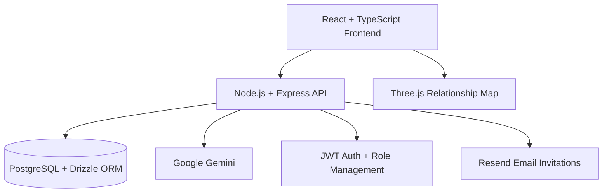

# Think-Inn Ecosystem

> AI-supported innovation platform for turning ideas, research, and internal knowledge into structured product opportunities.

Think-Inn explores how organizations can collect ideas, connect them with research, evaluate them with AI assistance, and move promising concepts toward projectization.

The core idea is simple: innovation work should not live in scattered documents, informal chats, or disconnected brainstorming sessions. It should become a structured, searchable, and collaborative product workflow.

[Live Prototype](https://think-inn-ecosystem.replit.app)

---

## Product Snapshot

| Area | What Think-Inn Does |
|---|---|
| Idea intake | Captures ideas through conversational AI instead of static forms |
| Research connection | Links research inputs with relevant ideas and product opportunities |
| AI evaluation | Supports prioritization with summaries, categories, risks, and roadmap views |
| Knowledge mapping | Visualizes relationships between ideas, research, and projects |
| Collaboration | Creates discussion spaces around innovation topics |
| Projectization | Helps validated ideas move toward structured execution |

---

## Why It Matters

Many internal innovation processes lose value because signals are fragmented.

Ideas stay isolated. Research is not connected to execution. Prioritization depends too much on informal context. Teams often know there is value somewhere in the organization, but the path from signal to product opportunity is unclear.

Think-Inn is a product experiment around that problem.

It uses AI not as a replacement for judgment, but as a structuring layer that helps teams:

- reduce friction in idea capture,
- detect connections between research and ideas,
- reduce duplicate thinking,
- make product opportunities easier to compare,
- keep human decision-making at the center.

---

## Product Flow

---

## Core Capabilities

| Capability | Product Value |
|---|---|
| Conversational intake | Makes contribution easier for non-technical users |
| AI-generated summaries | Turns long inputs into reviewable product signals |
| Semantic matching | Connects research, ideas, and opportunities |
| Idea evaluation | Adds structure to prioritization discussions |
| 3D relationship map | Makes hidden dependencies and clusters visible |
| Community spaces | Keeps collaboration close to the idea lifecycle |
| Role-based management | Supports controlled internal usage |

---

## My Role / Product Perspective

This project reflects my focus on AI-powered product systems where the goal is not automation alone, but better decision quality.

Key product questions behind Think-Inn:

| Product Question | Design Direction |
|---|---|
| How can AI reduce friction in idea capture? | Replace rigid forms with chat-first input |
| How can research become actionable? | Connect research to ideas and product decisions |
| How can teams evaluate ideas consistently? | Use structured summaries, risks, and roadmap views |
| How can innovation signals stay visible? | Map relationships between inputs, discussions, and projects |
| How can AI remain safe in the workflow? | Keep AI as an assistant layer, not the final decision-maker |

---

## Architecture Overview

---

## Technology

| Layer | Stack |
|---|---|
| Frontend | React, TypeScript, Vite, Tailwind CSS |
| Data / State | TanStack Query |
| Backend | Node.js, Express, TypeScript |
| Database | PostgreSQL, Drizzle ORM |
| AI | Google Gemini |
| Visualization | Three.js, React Three Fiber |
| Auth | JWT, bcrypt |
| Email | Resend |
| Validation | Zod |

---

## Current Status

Public product prototype and portfolio project.

The project is useful as a showcase for AI-supported product thinking, product workflow design, and the transformation of scattered organizational knowledge into structured product opportunities.

---

## Portfolio Context

Think-Inn is part of my broader product focus around:

- AI-supported product systems,
- CRM and customer operations workflows,
- omnichannel customer experience,
- decision-support tools,
- human-in-the-loop AI design.
